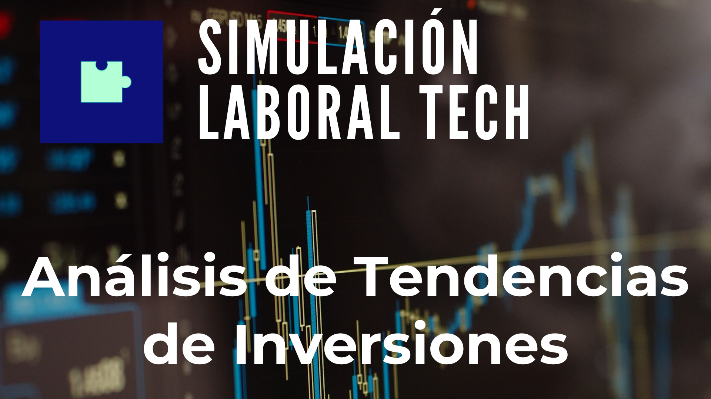
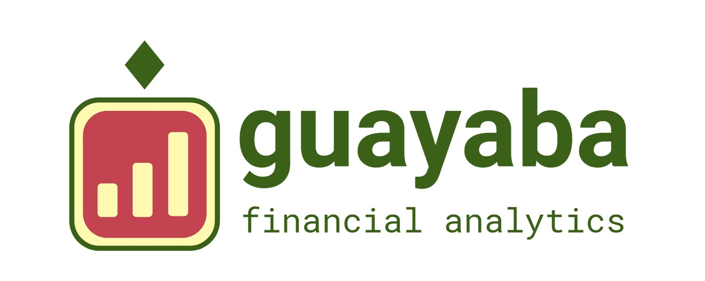
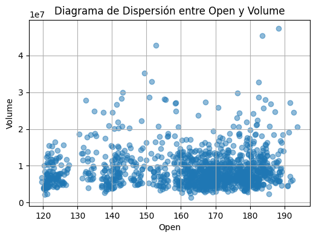
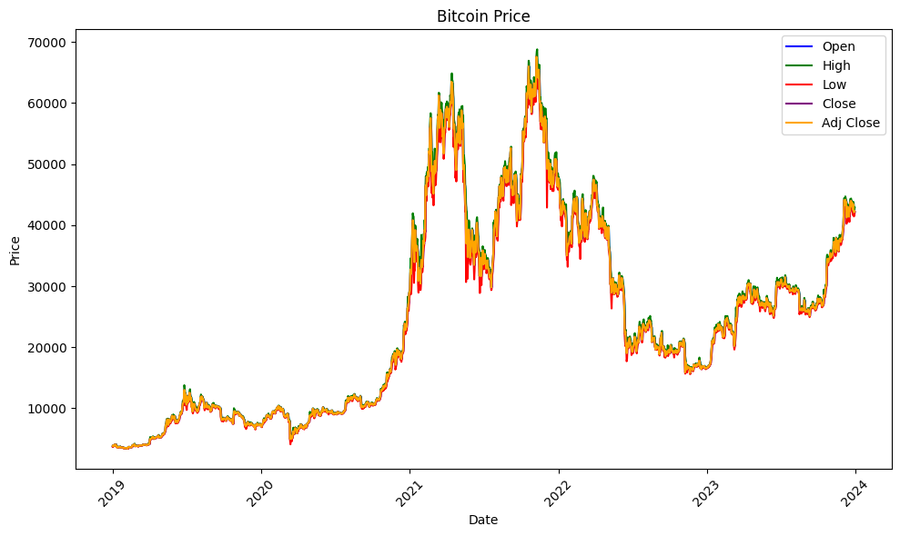

  
  

  <h1

  <h1 align="center">EQUIPO DE TRABAJO </h1>

   </h1>

  <h1 align="center">ESQUEMA GENERAL DEL PROYECTO </h1>

  

## **Descripción y Contexto**

Guayaba es una plataforma web diseñada para brindar servicios de gráficos de análisis técnico a traders e inversores en el mercado financiero mediante una amplia base de datos. Permite incorporar indicadores, analizar tendencias y visualizar métricas de cualquier activo financiero, accesible a usuarios novatos como a integraciones en brokers, exchanges y fondos de inversión.

 **Análisis Técnico Avanzado:**

- Gráficos interactivos y herramientas de análisis técnico.
- Indicadores personalizables para un análisis detallado.

 **Datos en Tiempo Real:**

- Precio en tiempo real de una variedad de activos financieros.
- Actualizaciones instantáneas para una toma de decisiones oportuna.

**Análisis Fundamental Integral:**

- Datos históricos y métricas de diferentes monedas y ecosistemas bursátiles.
- Cobertura completa de acciones, bonos, índices, criptomonedas, forex, etc.

**Portfolios Personalizados:**

- Seguimiento de activos en la moneda local del usuario.
- Conversión automática a las tasas de cambio más relevantes.

**Solicitud de Análisis Personalizado:**

- Los usuarios pueden solicitar análisis detallados de activos específicos.
- Resúmenes entregables a través de paneles interactivos.

**Integración mediante APIs:**

- Permite conectar con usuarios avanzados para el seguimiento de precios.
- Brinda la posibilidad de incorporar a la web de un bróker, exchange o listador de precios.

## **Paquetes de Servicios**

Se pretende ofrecer distintos paquetes para satisfacer las necesidades de los usuarios:
  
**Gratuito:**
- Acceso básico a las herramientas de análisis técnico.
- Datos en tiempo real limitados.
  
**Premium:**
- Funcionalidades avanzadas de análisis técnico y fundamental.
- Datos en tiempo real completos.
- Creación y gestión de portfolios.

## **Ubicación**

Diseñado y desarrollado en Argentina, Guayaba permite adoptar las cotizaciones de activos locales e incorporar las variables circunstanciales de la macroeconomía.

## **Datasets**

Se trabajó con pares BTC-USD, GLD-USD y S&P500PX-USD. Los archivos iniciales se descargaron en formato CSV desde la página de [Yahoo Finanzas](https://es.finance.yahoo.com/) y estan disponibles en la carpeta Data Cruda del repositorio.

📄 BTC-USD_Yahoo.csv   📄 GLD-USD_Yahoo.csv   📄 S&P500SPX-USD_Yahoo.csv

Los archivos contienen las columnas: Date, Open, High, Low, Close, Adj Close, Volume.

## **Tecnologías Utilizadas**

## **Análisis Exploratorio de los Datos (EDA) y Extracción, Transformación y Carga (ETL)**

Se analizó la estructura de los datasets, cantidad de filas y columnas, tipos de datos, datos nulos, duplicados, relacion entre los mismos, variables descriptivas, etc. Los archivos resultantes se exportaron y guardaron en formato CSV.

El EDA y ETL realizados se puede consultar en el repositorio.

## **Visualización de los Resultados (Power BI)**

Con la creación de un dashboard de Power BI se realizó el análisis integral y visualización de los datos. Con una interfaz intuitiva y capacidades avanzadas de análisis, esta herramienta facilita la creación de paneles interactivos y visualizaciones para la toma de decisiones informadas y colaboración en tiempo real. 

## **Modelo de Machine Learning**

Con el uso de modelos de Machine Learning se desarrolló un modelo predictivo mediante el análisis de datos históricos, el mismo permite prever tendencias futuras y mejorar la toma de decisiones empresariales, automatizar procesos, identificar patrones y mejorar la eficiencia operativa. 

Contexto del proyecto: El proyecto simula un entorno real de trabajo en el departamento de Data de una empresa, lo que sugiere que el objetivo es aplicar técnicas de análisis de datos para obtener información útil para la toma de decisiones.

## **Pagina Web y Móvil**

La web de Guayaba fue creada con la aplicación *Durable*, en formatos desktop, tablet y móvil. También contiene links a los dashboards y perfiles del equipo.
[Link ](https://guayaba.mydurable.com/es)

## **Conclusiones**

Se trabajó con tres pares de datos financieros: BTC-USD, GLD-USD y S&P500SPX-USD descargados desde Yahoo Finanzas. Se utilizaron diversas tecnologías y herramientas, incluyendo Python, NumPy, Pandas, Scikit-learn, Matplotlib, Seaborn, Excel, Power BI y Machine Learning para llevar a cabo el proyecto y realizar un análisis exhaustivo de los datasets para comprender su estructura, calidad y relaciones entre variables. 

Se utilizó Power BI para crear visualizaciones interactivas y paneles informativos que faciliten la interpretación de los datos y la toma de decisiones y se desarrolló un modelo predictivo utilizando técnicas de Machine Learning para prever tendencias futuras y mejorar la toma de decisiones empresariales. 

## **Recomendaciones**

Implementar un ciclo de retroalimentación continua para mejorar la efectividad del modelo predictivo y las visualizaciones realizando ajustes y mejoras en función de los comentarios recibidos, las nuevas tendencias en los datos y los cambios en el entorno empresarial. 

Explorar la incorporación de más fuentes de datos para enriquecer aún más el análisis y mejorar la precisión del modelo predictivo. La inclusión de datos adicionales, como indicadores económicos, datos de redes sociales o información demográfica, podría proporcionar una visión más completa y perspicaz de los factores que afectan a las tendencias financieras. 

## **Contactos:**

Lorena Paola Satori 

Nicolas Encina Tutuy 

Daniela Arvelo 

Duniet Marrero García 

